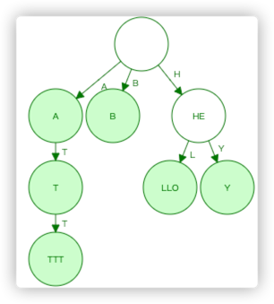
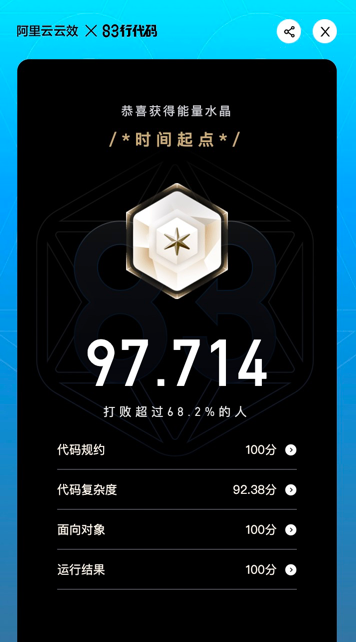

第一次完整地参加了一次代码大赛, 即阿里云举办的 [83行代码](https://code83.ide.aliyun.com/billboard). 
整体没有特别投入, 所以最终成绩也不算特别好. 

---
第二题: 一看题目就想到使用TrieTree, 但整体优化思路跟Perf工具没有特别好. 最主要是内存占用优化绕了圈子, 最终也没有走出来. 个人对最终结果不是特别满意.

- 具体实现在这里: [round2](https://github.com/DavyJones2010/2021-code83-round2.git)
- Update 20211114: 经过赛题详解与后续反思, 思考问题出在如下地方:
  - 由于抽象出了Node对象, 从而每个字符节点对应一个对象, 而
    - [Java中空对象占用至少16Byte](https://www.jianshu.com/p/1ca4b72d50f1)
    - [Java中引用占用至少占用4Byte](https://www.jianshu.com/p/1ca4b72d50f1)
  - 所以虽然实际Node对象中只有一个char/byte, 但实际占用空间至少是 16B+1B 
  - 所以官方给出的优化方案是: 
    - 减少Node对象数量:
      - 使用 [RadixTree](https://www.cs.usfca.edu/~galles/visualization/RadixTree.html) 
      - 使用数组等方式, 不生产对象

---
第三题: 基本面向对象的重构完全没问题. 但正确率一直在50分. 始终想不到哪里的逻辑出错了. 
主要一方面原因可以归结于题目描述过于含糊, 感觉成了阅读理解. 等待最终结果公布再看下吧.

- 具体实现在这里: [round3](https://github.com/DavyJones2010/2021-code83-round3.git)
- Update 20211114: 经过赛题详解与自我反思, 终于查明了原因:
  - 与正确答案对比, 发现我提交的代码逻辑是没有错的!
  - 但由于题目里没有说清楚到底怎么评判结果, 个人以为是通过sysout等方式, 但实际推测应该是将构造函数中的items都在外部重新循环一遍查看.
  - 由于我的实现里, 新new出了新的items, 完全没有使用外部传入的. 所以评判结果一直是错误. 后续按照官方的意图修改了下, 就OK了.
  - 这个真是坑爹!!! 



--- 
第四题: 时间比较紧张, 但基本思路还OK. Bug基本也修复了. 
```
1. SpringSecurity禁用掉CSRF校验
2. addUser时, 使用的admin账号的密码有误, 使用了基础的BaseAuthentication方式, 账号&密码是用base64编码的. 修复掉初始化时的admin密码即可. 
3. 权限设置也有点问题. 很简单就修复了. 
4. 根据协议反序列化为String时, 不能把编码方式放在ThreadLocal里. 
5. DataBuffer转化为byte[]是, 细节处理的不太好. 
```

不过最终算是把乱码问题也都修复了. 在这个过程查漏补缺, 发现个人对DataBuffer不是特别熟悉, 找机会恶补一波.


---
总结, 整体还是比较顺利的, 个人也真切感受到了其中的迷茫紧张与乐趣, 也得到了一些技术上的进步. 

最终虽然只集齐了8个线索, 但基本满足预期, 可以另一个限量版的公仔哇咔咔.

总体来说作为一个工作多年的老司机, 被这么多后辈成绩甩在后边, 真是心有不甘, 后生可畏, 继续努力!

后续有这种活动, 还要继续参与, 简直是小投入, 大回报, 其乐无穷~

---
另外, 附加一个网站, 可以在线看到数据结构的生成逻辑, 十分方便: [Data Structure Visualizations](https://www.cs.usfca.edu/~galles/visualization/)