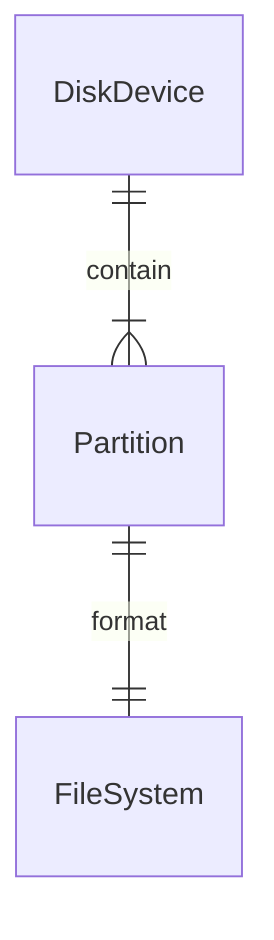

# 背景
经常会有个疑问: 
- 为什么磁盘需要进行分区, 不分区直接按照文件夹划分有啥问题? 这个在Windows下尤其有疑问.
- 为啥需要挂载? 直接插入设备, 为啥不能像Windows下U盘一样直接热插拔? Linux下为啥还需要手动挂载下? 
- 分区与格式化以及文件系统有啥关系与区别? 是一对一的么? 一个分区下只能有一个文件系统么? 一个文件系统下只能有一个分区么?

# 为啥需要分区?
## 前言
习惯了使用Linux/Mac之后, 完全没有分区的概念了.
- Linux/Ubuntu装机步骤:
  - 一整块磁盘, 选定文件系统类型, 进行格式化.
  - 直接在磁盘上安装操作系统, 就可以开始使用了.
- Mac甚至无需装机, 开机直接使用.

实际使用过程中, 不分区有如下优势:
- 软件安装: 无需关注需要把软件安装在哪个盘(C盘/D盘/E盘...), 通常只需要默认路径就好;
- 文件下载存储: 无需关注文件要保存在哪个盘, 只需要关注保存在哪个目录即可.

> 因此完全不用担心到底分几个区, 每个分区大小多少, C盘满了如何扩容之类的问题.

因此, 在攒了台Windows机器之后, 犹豫要不要分多个区. 后来事实教会了我怎么做人.
> Win10很无节操地会在C盘预留30GB+的空间, 还要放虚拟内存文件等, 导致可怜的C盘立刻存储报警.

## 个人实践理解
个人使用下来, 唯一的理由就是: **分区隔离, 方便无损重装系统.**

Mac/Linux上, 几乎无需也没有重装过系统. 但**在Windows下, 重装系统简直是常态**. 

> 垃圾(病毒)软件太多, 连所谓的纯净镜像也根本不纯净.
- 都想往注册表里偷偷塞东西. 清理注册表, 一不小心就会把系统清理蓝屏.
- 或者有病毒, 直接系统崩溃.

> 解决方案
- 要么通过PE进入系统, 找到问题点, 进行修复. 
- 要么直接重装系统. 
- 找到问题点太麻烦, 所以还是无脑一键重装吧.

但重装系统, 就需要把分区重新格式化. 想想吧, 辛苦安装的软件, 设定的配置, 保存的文件, 都会随着格式化被完全抹除!
所以还是分区吧, 只格式化C盘就好. 软件啊, 文件啊, 配置啊, 都放到其他盘里好了.

## 其他专业理由
参照知乎 [其实windows分区是不是分C盘和D盘就好了？](https://www.zhihu.com/question/47538075/answer/107737383) 回答.
- 病毒泛滥, 会把系统搞Crash, 需要频繁重装系统.
- 早期的FAT16/32文件系统支持的单个分区容量有限. FAT32最大文件系统总容量 128GB, 在现在随便一个硬盘就是1TB+, 无法充分利用磁盘空间.
- xp之前的windows系列操作系统本身稳定性堪忧，很容易因为用户操作、软件故障崩溃甚至破坏。尤其是经常折腾的桌面系统。这就导致用户不得不频繁重装系统。
- 操作系统权限&软件兼容问题: 现在win10管理员权限小了，某些软件装在C盘会有权限问题，比如notepad++装在C盘，直接运行的话是不能保存自定义配置的

> 所以在Windows下, 还是老老实实分区吧! 当然在严肃的企业场景, 也推荐按照系统盘与数据盘进行下区分.

# 为啥需要挂载?
尤其是在Linux下, 设备可以从 /dev/sda[b] 路径下获取, 为啥不能直接操作这些设备? 还需要挂载(mount)下?

## 为啥磁盘需要挂载才能使用?
### 为啥不能直接操作`/dev/sda[b]`等裸设备?

### 挂载具体做了啥? 
本质上, Windows下也是有挂载这一步的, 本质上挂载就是把分区/磁盘格式化之后的文件系统, 挂载到操作系统文件树下, 映射到某个目录, 
便于操作系统

### Windows下也有挂载么?
是的. Windows下

## 为啥不能像Windows一样, 插入设备直接默认挂载?
这个搜索了知乎, [得到的结论](https://www.zhihu.com/question/524667726/answer/2437578886)是: 
1. Unix-like的操作系统不支持自动mount原因是为了权限控制
> POSIX权限的概念出现的很早，Unix、Linux都是支持POSIX权限的。
> 那么对于一个新设备来说，操作系统不是很确定是不是所有用户都对这个设备有访问权限，
> 这种情况下，如果自动mount，那么这个设备的内容就可能会被所有用户看到，
> 这样会有安全的隐患。所以Unix和Linux才要求必须先mount，
> 并且mount命令必须要用root权限，也就是说对于一个未知的设备，
> 必须由root来决定是不是可用的。
> 
> 所以，这种设计的原因已经很清晰了，就是为了权限控制。

2. Windows不需要这个机制，是因为Windows是从DOS发展过来的，这个过程中一直没有权限控制，
> 所以Windows也不需要mount

3. Linux也可以做到自动挂载, 例如Ubuntu就是自动挂载的


# 磁盘&文件系统的扩展知识

## 磁盘, 分区, 文件系统 关系 
如下: 


### 磁盘/块设备 -> 分区
一个磁盘设备(HDD, SSD, U盘等), 可以划分为多个分区. 分区方式有MBR, GPT两种. 
那么磁盘分区的元信息写在哪里? 
- 是存储在文件系统中么? 此时磁盘还没有文件系统, 所以应该不是以文件形式保存, 所以我们也就无法直接在操作系统里找到这个文件并操作.
- 是存储在裸设备的固定位置(它在硬盘上的三维地址为（柱面，磁头，扇区）＝（0，0，1）。)
- 通过 `lsblk` 命令查看已经挂载的块设备
```shell
root@662fd3213ce8:/data# lsblk
NAME   MAJ:MIN RM  SIZE RO TYPE MOUNTPOINT
vda    254:0    0 59.6G  0 disk
`-vda1 254:1    0 59.6G  0 part /etc/hosts
```

### 分区 -> 文件系统
一个分区对应一个文件系统. 因此同一个磁盘设备的多个分区, 各个分区都可以格式化成不同的文件系统类型.
- 通过 `df -h` 命令查看分区
```shell
root@662fd3213ce8:/data# df -h
Filesystem      Size  Used Avail Use% Mounted on
overlay          59G  2.7G   53G   5% /
tmpfs            64M     0   64M   0% /dev
shm              64M     0   64M   0% /dev/shm
/dev/vda1        59G  2.7G   53G   5% /data
tmpfs           3.9G     0  3.9G   0% /proc/acpi
tmpfs           3.9G     0  3.9G   0% /sys/firmware
```

### 文件系统类型描述元数据


TODO: 暂时还没搜索到相关信息.


### 文件系统内部目录&文件元数据:
- 例如ext4, 以inode形式保存. 包括文件大小, 权限信息, gmtCreated, gmtModified, 包含的block数量, 存储在磁盘的位置(柱面) 等
- 可以使用 stat 命令查看

```shell
root@662fd3213ce8:/data# stat dump.rdb
  File: dump.rdb
  Size: 105       	Blocks: 8          IO Block: 4096   regular file
Device: fe01h/65025d	Inode: 1055693     Links: 1
Access: (0600/-rw-------)  Uid: (  999/   redis)   Gid: (  999/   redis)
Access: 2022-10-12 16:01:07.043330092 +0000
Modify: 2022-06-26 10:16:40.880774990 +0000
Change: 2022-06-26 10:16:40.896774990 +0000
 Birth: 2022-06-26 10:16:40.869774990 +0000
```


TODO: 分析下stat的具体信息含义, 尤其是 Device 相关的, 是不是操作系统直接就按照这个信息去寻找到文件的柱面范围了?


### 分区名称规范
- 在Linux系统中，硬盘分区命名为sda1－sda4或者hda1－hda4



TODO: 自己找个U盘试下划分成多个分区, 每个分区不同的文件系统类型?



