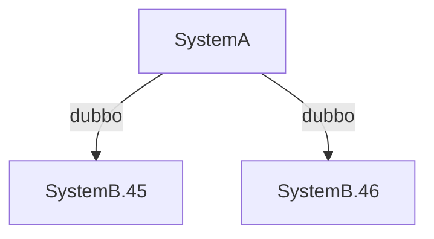

# 背景

## 应用拓扑

- SystemA作为client, 通过dubbo接口调用SystemB提供的某个服务
- SystemB由2台机器组成一个集群, 即 SystemB.45 SystemB.46




## 详细问题

SystemA调用SystemB的服务时:

1. SystemA日志中持续性出现调用SystemB失败, 详细错误信息如下:

2. 且**SystemA报错日志都固定出现在SystemB.46这台机器上**


# 问题1: 为啥出现"channel is closed"错误, 从而导致调用失败?

## 现象:

根据源代码分析只有底层TCP连接关闭, 才会有该错误报出. 但为啥TCP连接会关闭?

1. 是因为网络闪断么? 理论上内网环境下, 链路可靠, 不应该频繁发生.
2. 是客户端主动关闭? or 服务端主动关闭?

按照100ms一次打印某个dubbo服务的TCP连接状态. 发现每隔2~5min, dubbo的TCP连接就会重建. 而且观察到重建时是Provider处于TIME_WAIT状态, 也就知道是Provider主动关闭连接的.

基本可以确认, TCP连接是服务端主动关闭的.

## 原因:

1. **因为provider主动把连接空闲关闭掉了**

查看服务端hsf-remoting.log, 发现如下频繁的关闭TCP日志.


2. Provider的HSF版本2.2.10.1, 查看对应代码, 发现使用的是Netty io.netty.handler.timeout.IdleStateHandler 方式进行链路空闲检测, 默认超过 90s 没有数据传输, Provider就会主动关闭TCP连接.
3. Consumer侧, 抛错的地点是: com.alibaba.dubbo.remoting.transport.AbstractClient#send , 即在发送数据包时发现TCP连接已关闭, 抛出异常.

## 解决:

### 方案1: 增大空闲阈值 
增加如下启动参数, 扩大服务端空闲时长, 15min; 一般SystemA调用不太会15min都没有请求, 每次业务请求进来, 也都会重置时间, 基本能保证TCP长连不断.

```java
-Dhsf.server.idle.time=900
```

增加参数之后, 查看 hsf-remoting.log, 就没有频繁的CloseIdle日志了, 查看TCP连接, 发现连接端口长期保持稳定, 没有再发生重建, 查看线上错误日志, 发现该错误消失, 问题解决.


### 方案2: 缩短心跳间隔
减小客户端心跳发送间隔. (dubbo 默认心跳包间隔为 60s)
在`dubbo-config.xml`主配置文件里, 增加如下配置:
```xml
<dubbo:protocol name="dubbo" heartbeat="20000"/>
```


### 最终方案: 缩短心跳间隔
- 方案1主要问题是改造量大, 需要修改应用的部署脚本, 而本身应用是未docker化的, 部署脚本在aone中需要单独的环境包发布. 一旦其他环境初始化没有增添该配置, 就会导致问题重现. 而修改代码配置文件则更好维护.
- 方案1也有优势, 即心跳包发送频率低, 60s一次, 而非新修改的20s一次, 对consumer侧压力会小一些.
但综合考虑, 心跳包频率增加对应用压力代价其实很小, 最终决定选择方案2.

# 问题2: 为啥channel is closed异常信息中, 总是集中在某个特定provider channel closed?

## 现象:

如 cn-chengdu, SystemA调用SystemB日志, 总是说 SystemB.46:12200 的channel closed, 而另外一个provider SystemB.45:12200 从来没有抛出异常.


1. 难道说只有SystemB.46的TCP连接会Idle重建, SystemB.45 就不会重建么?
    1. 并不是, 查看 SystemB.45 的 hsf-remoting.log 日志, 发现与 46 基本相同, TCP连接会频繁重建.


2. 为啥没有报出: SystemB.45 channel is closed 呢?

## 原因:

- 根本原因是dubbo client发起RPC调用前 连接状态检测 + failover策略 导致的:

1. dubbo client发起调用时, com.alibaba.dubbo.rpc.cluster.support.FailoverClusterInvoker#doInvoke
2. 会使用 com.alibaba.dubbo.rpc.cluster.support.AbstractClusterInvoker#select 来选择一个合适的provider(代码里叫invokers), 核心逻辑如下:


1. loadbalance.select(invokers, getUrl(), invocation); 随机选择一个provider(例如 SystemB.45 ), selected为null, 如果 SystemB.45对应的TCP连接关闭, 则 invoker.isAvailable() 为false, 从而进入 reselect流程, 如果 46对应的TCP连接也关闭, 则 reselect 返回的rinvoker为null, 从而进入
2. 所有可能case如下, 可以知道抛出异常时, 肯定错误信息是46失败, 因此就解释了上边的问题.

| 45机器状态 | 46机器状态 | loadbalance结果 | 最终AbstractClusterInvoker#select结果                        |
| ---------- | ---------- | --------------- | ------------------------------------------------------------ |
| 45 TCP正常 | 46 TCP正常 | 选中45          | 直接使用45作为provider, 不会抛出异常.                        |
| 45 TCP正常 | 46 TCP正常 | 选中46          | 直接使用46作为provider, 不会抛出异常.                        |
| 45 TCP正常 | 46 TCP异常 | 选中45          | 直接使用45作为provider, 不会抛出异常.                        |
| 45 TCP正常 | 46 TCP异常 | 选中46          | 调用前reselect到45, 从而调用成功, 不会抛出异常.              |
| 45 TCP异常 | 46 TCP正常 | 选中45          | 调用前reselect到46, 从而调用成功, 不会抛出异常.              |
| 45 TCP异常 | 46 TCP正常 | 选中46          | 直接使用46作为provider, 不会抛出异常.                        |
| 45 TCP异常 | 46 TCP异常 | 选中45          | 由于45的index为0, index+1, 从而就尝试failover到46, 返回46. 后续在invoke时, 由于46也是关闭, 因此抛出46失败. |
| 45 TCP异常 | 46 TCP异常 | 选中46          | 由于46的index为1, 不再index+1(否则就IndexOutOfBoundsException啦), 从而返回46. 后续在invoke时, 由于46也是关闭的, 因此抛出46失败. |

3. 由此可以下结论, 当providers数量>=2时, 在发生该异常时, 报错信息里必然不会有第一个provider, 因为第一个provider失败, 会index+1, 返回第2个. 以同样抛错的"SystemC"为例进行观察, 验证了该猜想:
    1. 抛出的channel is closed信息中, provider只有, "SystemC.40"  "SystemC.173" "SystemC.240" "SystemC.17" "SystemC.174" , 而没有排在第一个   SystemC.183 这个provider.

# 问题3: 为啥channel会空闲被关闭? 心跳保活机制失效了么?

dubboclient, 默认会60s发送一次心跳包, 所以服务端空闲timeout是90s>60s, 理论上链路应该一直保活, 但为啥?

## 现象

实际用tcpdump查看了下, 发现稳定是2min一次的心跳, 为啥不是1min一次?


- 上边tcpdump出来的确定是心跳包么?
- 是心跳包! 如下TCP包数据段内容为: dabbe200000000000005d772000000014e 查看代码:
_com.alibaba.dubbo.remoting.exchange.codec.ExchangeCodec#encodeRequest_, 可知内容符合dubbo心跳包协议:

1. 以 0xdabb 为开头
2. isTwoWay, isEvent都为true; 因此按照如下运算可知, 第三个字节是 0xe2

```java
header[2] = (byte) (FLAG_REQUEST | serialization.getContentTypeId()) ;
if (req.isTwoWay()) header[2] |= FLAG_TWOWAY;
if (req.isEvent()) header[2] |= FLAG_EVENT;
```

3. 心跳包的mData为null, 通过hessian2序列化之后, _com.alibaba.com.caucho.hessian.io.Hessian2Output#writeNull_, null占用一个字节, 会被默认写作 N
4. 整个TCP Payload为17个字节, 包括 16个字节的dubbo协议头 +  1个字节的0x4e(即为N的ASCII码), 符合实际抓包情况.


## 原因

- 根本原因是 com.alibaba.dubbo.remoting.exchange.support.header.HeartBeatTask 设计缺陷导致.

1. HeartBeatTask 是在com.alibaba.dubbo.remoting.exchange.support.header.HeaderExchangeServer#startHeatbeatTimer进行启动, 使用ScheduledExecutorService, 定时执行间隔时间为heartbeat值, 即为60s(60000ms)一次.
2. HeartBeatTask 执行具体实现(删除了与本问题不相关的代码):

```java
public void run() {
    long now = System.currentTimeMillis();
    for ( Channel channel : channelProvider.getChannels() ) {
        Long lastRead = ( Long ) channel.getAttribute(
                HeaderExchangeHandler.KEY_READ_TIMESTAMP );
        Long lastWrite = ( Long ) channel.getAttribute(
                HeaderExchangeHandler.KEY_WRITE_TIMESTAMP );
        if ( ( lastRead != null && now - lastRead > heartbeat ) // 注意: 这里的heartbeat是60000ms
                || ( lastWrite != null && now - lastWrite > heartbeat ) ) {
            Request req = new Request();
            req.setVersion( "2.0.0" );
            req.setTwoWay( true );
            req.setEvent( Request.HEARTBEAT_EVENT );
            channel.send( req );
            if ( logger.isDebugEnabled() ) {
                logger.debug( "Send heartbeat to remote channel " + channel.getRemoteAddress()
                                      + ", cause: The channel has no data-transmission exceeds a heartbeat period: " + heartbeat + "ms" );
            }
    }
}

```

3. 问题复现:
    1. 2022年09月27日18:53:00,000 触发一次HeartBeatTask, 假设本次执行到 channel.send(req), 即发送了心跳包.
    2. 由于发送了心跳包, 因此channel的 lastWrite 会被更新 假设被更新为 2022年09月27日18:53:00,001 (注意这个时间与执行HeartBeatTask会有几毫秒差异, 因为netty处理会耗时)
    3. 2022年09月27日18:54:00,000 再次触发一次HeartBeatTask, 当前时间(即为2022年09月27日18:54:00,000) - lastWrite(2022年09月27日18:53:00,001) 为 59999ms < 60000ms, 因此本次不再发送心跳包.
    4. 2022年09月27日18:55:00,000 再次触发一次HeartBeatTask, 当前时间(即为2022年09月27日18:55:00,000) - lastWrite(2022年09月27日18:53:00,001) 为 119999ms > 60000ms, 因此本次发送心跳包.  从上次心跳包到这次, 刚好间隔为2min.
4. 因此在链路空闲时, **两次心跳的间隔稳定为120s > HSF服务端的90s**, 因此服务端会频繁地关闭连接!

# 总结

1. dubboclient在进行failover之后, 报错信息不直观, 一直在报46调用失败, 从而导致以为只有46这台provider有问题, 从而以为是单台机器的问题, 从而误导了排查方向(例如46这台机器load, 网络等有啥特殊问题). 如果failover逻辑中, 不是简单地按照index+1, 而是使用环形数组, 这样报错信息会报出45, 46有问题, 从而不会误导排查方向.
2. 该问题只有在dubboclient与所有的provider的TCP连接都关闭, 从而failover失败, 从而抛出异常. 因此较为偶现, 导致无法稳定复现以及保存现场. (当然现在知道了原因, 就可以通过iptables来模拟重现该问题).
3. 根本原因还是HSF服务端对与dubboclient的适配不好:
    1. 默认参数90s+dubboclient默认的60s, 在小流量情况下完全是坑爹, 在大流量情况下, 由于业务请求一直会有, 相当于通过业务请求来进行保活了, 因此不会有本文的问题.
    2. HSF作为dubbo服务端阉割掉了dubbo原生服务端的反向保活能力(provider->client), 从而变成了单向心跳(client->provider), 可靠性差很多.
    3. 心跳保活作为RPC框架的基础, 出现问题通常是最后怀疑的点. 而如果用dubbo作为服务端, 要可靠得多, 有双向保活机制, 具体可以参照: [dubbo-现有心跳方案总结以及改进建议](https://dubbo.apache.org/zh/blog/2018/08/19/dubbo-现有心跳方案总结以及改进建议/?spm=ata.21736010.0.0.318e4799tOQZt9)