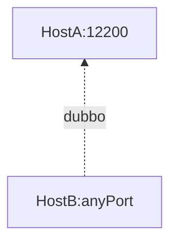

# 格式


# 样例

## 应用拓扑


## 拓扑说明
- HostA是服务端, 开启了12200服务端口
- HostB是客户端, 开启了任意端口与HostA:12200连接
- 在HostA上执行tcpdump 查看 HostA:12200 <-> HostB 的通信

## 命令实践
⁃ in 链路(即从B —>A:12200)
```shell
sudo tcpdump -i eth0 -P in -vv dst port 12200 and src host ${hostB}
```

⁃ out 链路(即从A:12200—>B)
```shell
sudo tcpdump -i eth0 -P out -vv src port 12200 and dst host ${hostB}
```

⁃ inout (即从A:12200<—>B)
```shell
tcpdump -i eth0  host ${hostB} and port 12200
```

⁃ dump 抓取具体包内容, 导出为文件, 便于wireshark分析 (注意, 这里导出的文件为二进制, 推荐使用.pcap作为后缀名)
```shell
sudo tcpdump -i eth0 -P in -vv dst port 12200 and src host ${hostB} -w ~/tcpdump.pcap
```

⁃ 读取tcpdump文件 (注意, 这里读取的文件也为二进制)
```shell
sudo tcpdump -r tcpdump.pcap
```


# Refs
- [linux下如何使用 tcpdump 进行抓包详细教程](https://blog.csdn.net/weixin_36338224/article/details/107035214)