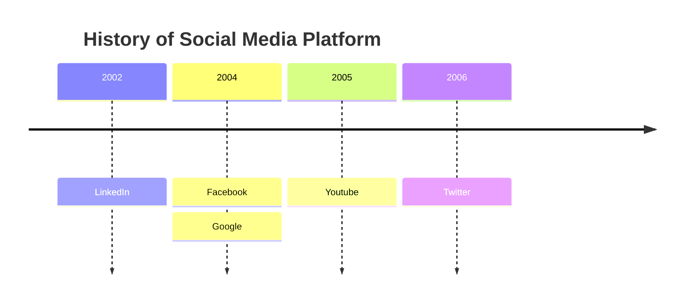
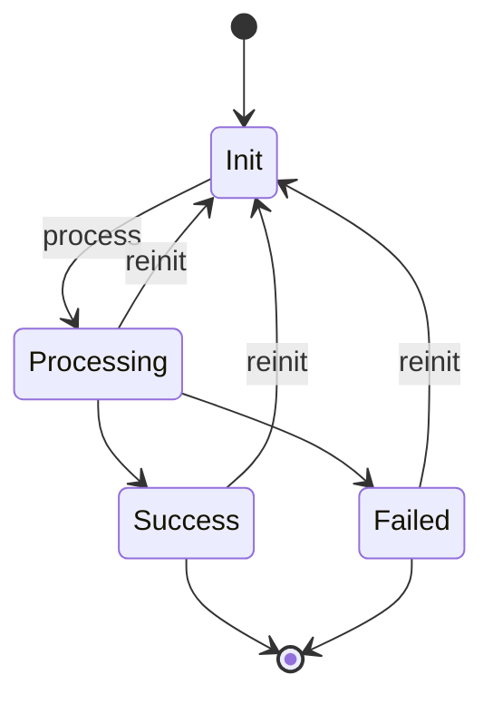
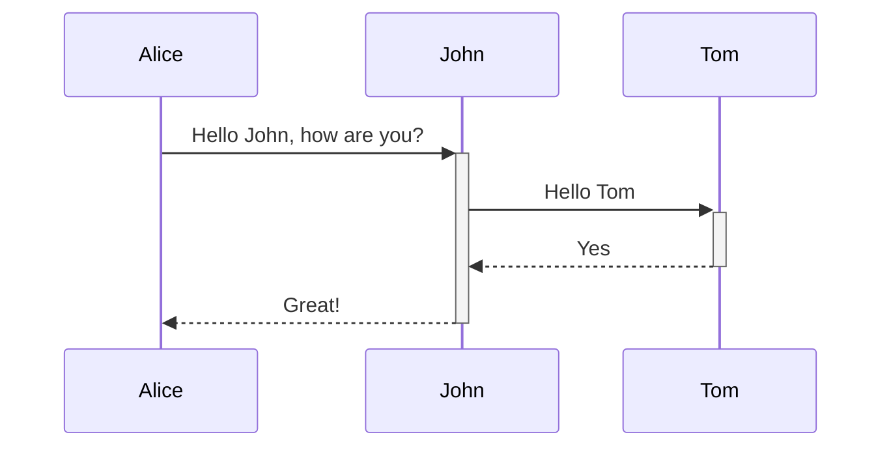
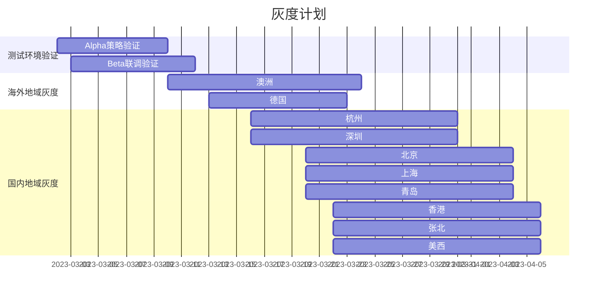
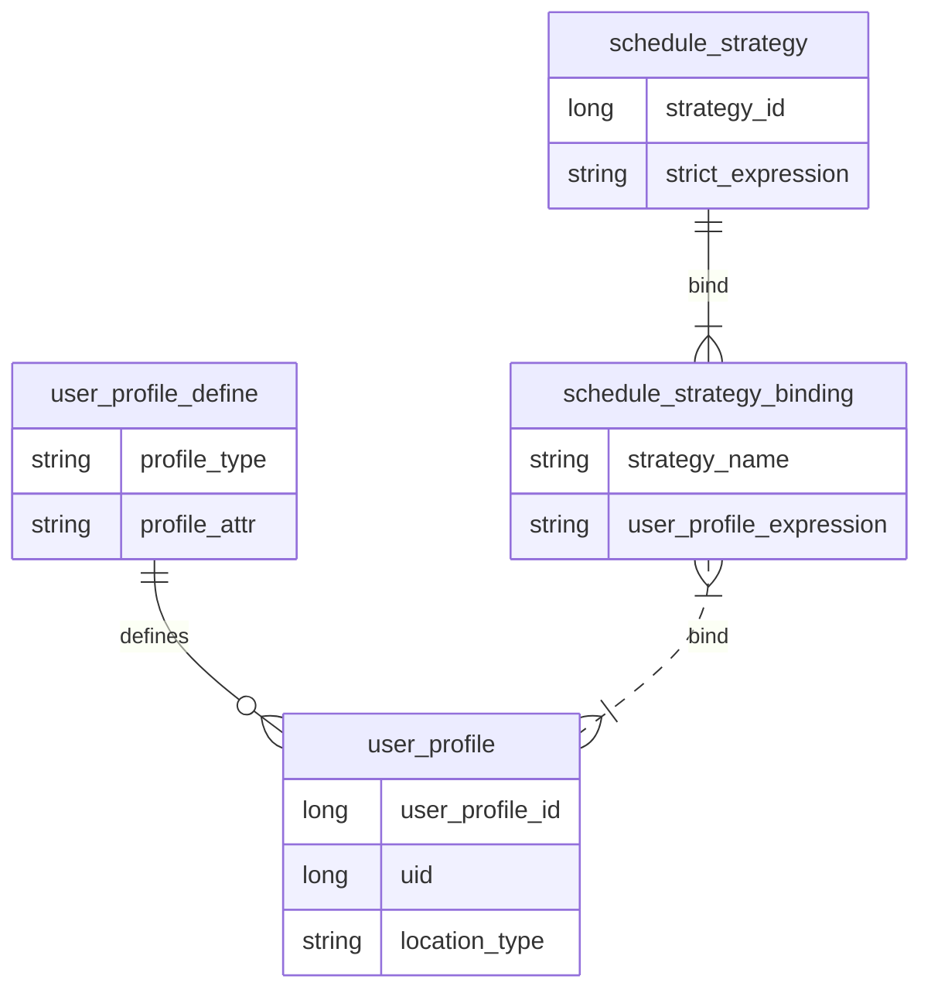
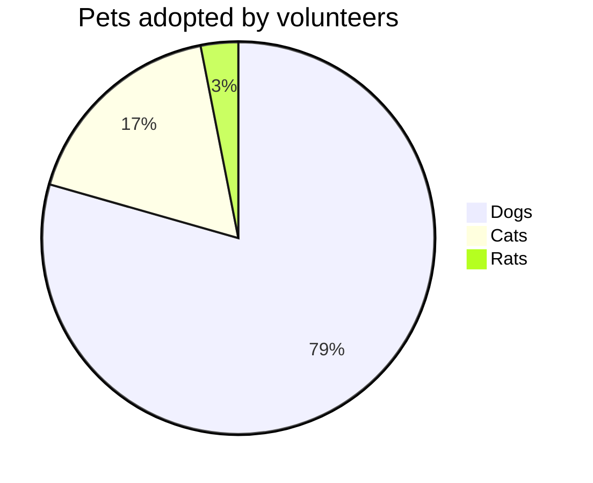

# Intro

## 背景
作为程序员, 除了日常敲代码外, 我们通常也要花很多时间在作图上.

- 汇报或者设计文档中, 一图胜千言.
- 但不想花过多时间在框框的对齐, 颜色的挑选, 样式的调整, 作图工具的选择上.

因此本文系统总结下自己用的工具与最佳实践.希望可以`make our hard life a little easier`. 


## 场景
- 对内/非正式:
    - 详细/概要设计文档
    - 代码逻辑/架构梳理
    - 个人数据分析
- 对内/外, 半正式:
    - 技术文章/Doc/博客
- 对外/正式:
    - 向上总结汇报
    - 项目KO/汇报

## 原则

- 优先: code化(diagrams-as-code), mermaid
    - 方便git版本管理
- 其次: draw.io > yuque 导出图片类型
    - png > svg > jpeg
- 最终: 美学上要有追求, 如色调风格统一
    - 如[Dubbo](https://cn.dubbo.apache.org/zh-cn/)使用蓝紫过渡色调


## 工具比较


| 名称                                            | Diagrams As Code | 是否收费(by 20230314) | 优势              | 缺点                                         | 推荐优先级         |
|-----------------------------------------------|------------------| --------------------- |-----------------|--------------------------------------------|---------------|
| [mermaid](https://mermaid.js.org/intro/)      | Y                | N                     | DAS, 项目活跃, 审美在线 | 支持图类型少(有潜力)                                | **高**: 设计文档优先 |
| [draw.io](https://app.diagrams.net/)          | N                | N                     | 图类型全            | 非DAS, <font color='red'>**注意保留源文件**</font> | **高**: 设计文档优先 |
| [语雀画板](https://aliyuque.antfin.com/dashboard) | N                | N                     | 图类型全, 审美在线      | 非DAS; 模板样例较少                               | **高**: 设计文档优先 |
| PPT/WPS                                       | N                | Y                     |                 |                                            | **高**: 汇报文档优先 |
| xmind                                         | N                | Y                     | 方便易用, 审美在线      | 适用范围窄: 只适合画思维导图                            | 中             |
| [ggplot2](https://ggplot2.tidyverse.org/)     | N                | N                     |                 | 适用范围窄: 只适合数学统计类                            | 统计类高优推荐       |
| [Rapid Tables Line Graph Maker](https://www.rapidtables.com/tools/line-graph.html)  | N                | N                     | 坐标轴图可以用数字精确表示   | 适用范围窄: 只适用坐标轴图  | 数字坐标轴类高优      |
| [Aliyun ROS Visual Editor]()                  | Y                | N                     | DAS             | 适用范围窄: 只适用云上部署图                            | 云上部署类高优       |
| ~~[plantml](https://plantuml.com/zh/)~~       | ~~Y~~            | ~~N~~                 | ~~DAS, 图类型全~~   | ~~过于陈旧, 废弃不用.~~                            | ~~废弃~~        |
| ~~gliffy~~                                    | N                | Y                     | ~~轻量~~          | ~~废弃~~                                     | ~~废弃~~        |
| ~~[processon](https://www.processon.com/)~~   | N                | Y                     | ~~模板样例多~~       |                                            | ~~废弃~~        |
| ~~staruml~~                                   | N                | Y                     |                 |                                            | ~~废弃~~        |


# 架构图(architecture)

- 特点: 宏观的, 上层的
- 使用场景: 汇报PPT
- 面向对象: 老板, 外部

## Landscape(Eco)

- 场景: 为了说明某个系统的关联生态
- 工具: draw.io
- Tips: 尽量使用Logo + 不规则形状 + 大箭头
- 样例:


## 业务架构图(豆腐块)

- 场景: 为了说明某个系统业务架构
- 工具: draw.io > 语雀画板
- Tips: 同色, 分层
- 样例:


## 技术架构图


## 云上部署图(Cloud Infra)

- 场景: 为了说明某个系统的部署架构
- 工具: draw.io> [rosdesigner](https://rosnext.console.aliyun.com/designer) 
- Tips: [rosdesigner](https://rosnext.console.aliyun.com/designer) 可以直接可视化编辑, 也可以基于已有实例生成拓扑. 缺点是不太美观.
- 样例:


## 逻辑示意图(重要)

- 场景: 为了说明某个工具/流程work的机制, 可用于汇报, 也可用于技术文章. 属于最灵活的一类.
- 工具: 语雀画板 > draw.io >> mermaid(可用但不灵活, 不美观)
- 样例:


## 坐标轴图(axis)

- 场景: PPT汇报里, 属于"逻辑示意图"的子类.
- 工具: [Line graph maker](https://www.rapidtables.com/tools/line-graph.html) >> draw.io > 语雀画板. 暂时没有数字描述的坐标图工具.
- 样例:


## 时间轴图(timeline)

- 场景: PPT汇报里, 展示项目整体milestone
- 工具: 语雀画板(实际使用脑图实现) > xmind > mermaid(版本需要升级, 且不太美观)
- sample:




# UML

- 特点: 微观的, 底层的
- 使用场景: 软件设计文档
- 面向对象: 开发人员, 内部人员

## 状态图(State Diagram)

- 场景: 描述某个状态机. 例如Java线程, NC状态, VM状态等. **不适合汇报**
- 工具: mermaid(不太美观) > 语雀画板 > draw.io
- Sample:




## 时序图(Sequence Diagram)

- 场景: 多个角色/系统间接口交互. 与泳道图相比, 更细粒度. **适合代码分析, 不适合汇报**
- 工具: mermaid
- Sample:




## 泳道图(BPM)

- 场景: 多个角色/系统间交互, 更多地面向功能. 与时序图相比, 更粗粒度. **适合汇报**
- 工具: draw.io
- Tips: 增加横向容器, 填充颜色, 线段交叉用arch
- Sample:


## 甘特图(Gantt Chart)

- 场景: 方便管理项目规划, 跟踪进展
- 工具: mermaid >> 语雀画板 > draw.io
- Tips: 横向section
- Sample:



## ER图

- 场景: 技术设计文档中使用, 不适合汇报
- 工具: mermaid
- Sample:




## 部署图(Deployment Diagram)

- 场景: 方便
- 工具:
- Sample:


# 统计图

- 特点: 面向数学统计类
- 使用场景: 个人分析, 汇报PPT
- 面向对象: 内部, 外部均可
- 工具: 推荐使用ggplot

## 饼图(Pie Chart)

- 工具: mermaid, ggplot2
- 使用场景: 研究报告, 汇报PPT
- 面向对象: 外部




## 散点图(带拟合)

- 工具: ggplot2
- 使用场景: 研究报告, 汇报PPT
- 面向对象: 内/外部


## 趋势图

- 工具: ggplot2
- 使用场景: 研究报告, 汇报PPT
- Tips: 拟合
- 面向对象: 内/外部


## 双向柱形图

- 工具: [ggplot2](https://zhuanlan.zhihu.com/p/445273345) >  [bioladder](https://www.bioladder.cn/web/#/pro/index) **可以在线生成, 紧急使用非常方便**
- 使用场景: 研究报告, 汇报PPT
- 面向对象: 内/外部


## 统计类其他图

当想不到该用哪种图来DataViz时, 可以从[AntV](https://antv-2018.alipay.com/zh-cn/vis/chart/index.html)里按照分类进行选取 


- 双轴图
- 热力图
- 雷达图: 使用 [Radar Chart | Chart.js](https://www.chartjs.org/docs/latest/charts/radar.html) 来在线制作


# 其他图

## 脑图

- 场景: 业务规划,
- 工具: yuque > xmind > mermaid(太丑, 且需要高版本)
- Sample:


## ASCII图

- 场景: CLI/DocFile里无法显示图片, 可以用ASCII图
- 工具: [asciiflow](https://asciiflow.cn/) (缺点是: 增加文本, 移动等操作不太灵活)
- Sample: 

```
     +-------error---------+
     |                     |
+----v----+         +------+---+-+         +----------+
|         |         |          | |         |          |
|  init   +---------> processing +-success-> finished |
|         |         |          | |         |          |
+----^----+         +----------+-+         +-----+----+
     |                                           |
     |                                           |
     |                                           |
     |                                           |
     +-------------------retry-------------------+
```

# 最佳实践

## 三级内容优化

- 分辨率优化: PNG缩放400%, 提升分辨率
- 工具熟练: 善用对齐


## 豆腐块配色优化

- 配色从 [~~colorbrewer2~~](https://colorbrewer2.org/#type=sequential&scheme=BuGn&n=3) [ColorGG 颜色搭配](https://www.colorgg.com/66cc66)中选择
- 大区域与小区域同色系, 不同深度


## 配色&字体-Ubuntu风格(cont'd)

- 配色: 不能用白底, 黑底(0x333333) + 绿字(0x33FF33) + 亮海蓝(0x2023A6) + 靛蓝(0x115354) + (0x481036)
- 字体: Comic Sans MS


## 配色&字体-SegmentFault风格

- 配色: 白烟色(0xF0F0F0) + 铬绿(0x188D5D) + 薄荷绿(0x199562)  + 暗岩蓝(0xA680B8)
- 字体: Verdana字体
  
