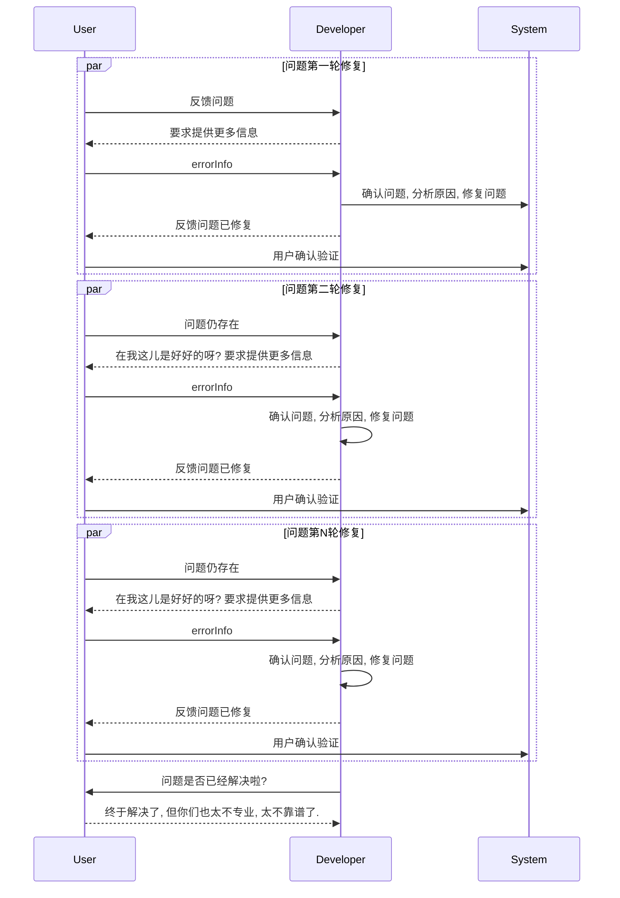
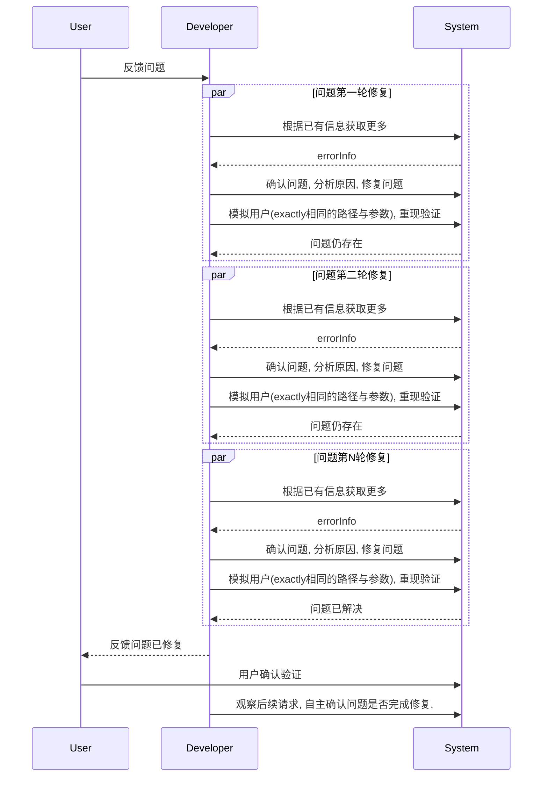

# 背景
常常在工作中会遇到一些不靠谱的合作伙伴, 会怒其不争; 也经常会发现与反思自己很多地方做得不靠谱不专业, 会深刻反省.
因此积累了一些案例与心得, 本文尝试进行下分享与总结.
希望大家看完本文能有所收获.  

# 几个案例

## 代码版本依赖问题
用户反馈[Jenkins插件]()依赖的fastjson版本太低, 有安全漏洞, 希望我作为maintainer, 能进行升级修复.
遂让同学进行跟进修复: 
1. 开发同学确认当前依赖的fastjson版本是低版本; 升级pom依赖, 发版本, 跟用户反馈升级完成.
2. 用户升级版本后, 发现依赖的版本还是老的. 
3. 开发同学再次确认, 发现是由于隐式引来到另外一个插件, 另外插件中. 修复; 跟用户反馈可用
4. 用户升级版本后, 发现依赖的版本还是老的.
5. 开发同学再次确认, 发现是由于真正依赖的是Jenkins框架中的fastjson, 升级Jenkins框架, 修复, 跟用户反馈可用 


真的可用了么?
专业么?
靠谱么?


## 资源预留问题
用户使用预留资源失败: 
1. 排查后发现是问题A(付费类型不匹配)导致, 修复问题A后跟用户反馈可用. 
2. 用户再次尝试, 发现还是不行, 排查后发现是还有问题B(预留资源尚未启用), 修复问题B后跟用户反馈可用.
3. 用户再次确认, 发现还是不行, 排查后发现是还有问题C(用户Quota不足), 修复问题C后跟用户反馈可用. 

反复多轮下来, 用户几乎崩溃, 质疑我们的专业度.

一言九鼎: 说解决了, 那就是解决了, 就是能够满足需求的.


## 数据线&遥控器问题
想要买一根一拖三的USB数据线, 是否支持快充? 支持华为/小米快充协议么? 最大支持多少瓦? USB2.0 or USB3.0? 最大传输速度是多少? 是否  
发现卖家除了价格, 别的一问三不知.  

家里的机顶盒遥控器失灵了, 型号是 `烽火HG689-J` 想要买个替换的, 但不想买跟原来一样款式的, 原来的太难用了.

遂上淘宝根据型号搜索`可用且好用`的遥控器, 标题上都写的支持`烽火HG689-J`型号, 问了几个卖家进行确认: 
- 不知所云型: 理解不了用户的诉求. 反复给我强调: `亲, 您就买跟现在一样的遥控器就好了`. 问题是现在这个`不好用`, 我压根不想用. 开启复读机模式. 
- 胡说八道型: 亲, 不通用呢.
- 一问三不知型: 亲, 您买回去试下吧.
- 装聋作哑型: 问了这个问题之后, 压根不理我.
- 靠谱型: 能用的, 可以的, 直接用. 直接泪目, 买买买! 


一言九鼎: 对自己负责的产品足够多的了解, 给用户有效的信息.


## 咖啡机&电脑电池问题
- 德龙的咖啡机, 用过一段时间后, 提示需要自洁&清洗. 使用专业的清洗剂, 详细专业步骤的指导.
- MacBookPro电池, 会检测循环次数与损耗度, 超过一定比例, 会提示用户进行更换. 可以很方便点击选择GeniusBar进行预约维修更换.


- 产品设计开发, 不是一锤子买卖, 需要考虑全生命周期. 售后同样很重要, 要做长久的生意.
- 牢骚太盛防肠断, 风物长宜放眼量


# 总结: 专业与不专业的行为模式比较
上边几个问题, 都透露出我们的不专业.
以`问题排查`为例进行下抽象: 

## 不专业的行为
如下, 整体Developer与User有`2N+1`次交互: 
1. 修复前: 打扰用户要求提供更多信息. 
2. 修复中: 涉及N轮与用户沟通确认重试等, 用户必然会失去耐心, 质疑我们的专业度.
3. 修复后: 还要打扰用户, 咨询是否修复了问题; 比这个更差的是, 有些同学根本不会有这一步. `Fire and Forget` 啦. 

## 专业的行为
如下, 整体Developer与User只有`1`次交互: 
1. 修复前: 根据现有信息去排查问题, 不打扰用户.
2. 修复中: N轮反复修复, 都在研发内部闭环, 不打扰用户.
3. 修复后: 研发自主去检查之后用户的请求, 自主确认问题修复情况, 不打扰用户.

# 思考: 如何变得专业?
## 如何做一个合格的Developer
目标: 做到**一言九鼎**(跟用户反馈解决/完成, 那就需要保证用户视角下100%是可用了, 不瞎说, 不误导), 少打扰用户. 
路径: 熟悉自己的产品.

## 如何做一个合格的User
尽量提供足够多的信息, 例如traceId, 发生环境, 发生时间点, 是否必现, 出现路径是怎样的, 使用文本而非截图. 

在系统不完善时, 需要合格的User. 但更重要的是**Developer在设计系统时考虑周全**, 把问题排查(售后)链路纳入考虑范围.
之前自己在作为User向中间件团队咨询/反馈问题时, 发现很多同学戾气很重, 经常埋怨用户没有提供足够多的信息, 让他们不好排查. 
有时候我们在吐槽用户给的信息不够多时, 是否可以思考下, 如何不苛求用户? 

# 其他
个人容易忽略的事情: 
- 给别人发一个报表/文档时, 是否把权限给他们打开了?

# 最后
"专业", "靠谱" 是非常严肃的定义, 要达成不易, 都需要耗费大量的心力与脑力:  
- 系统/产品设计时的推演能力
- 问题排查时的分析能力
- 问题修复后反复确认, 长期跟进的能力

希望大家都能做一个专业且靠谱的开发者! 共勉!